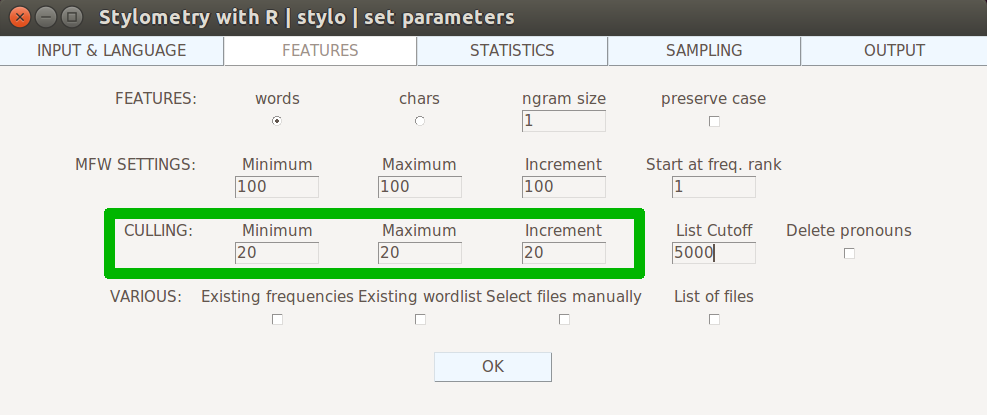

## Disclaimer
The presentation was first created for the participants of DHSI 2018 'Stylometry with R' course.

## What question lies ahead?
As we already know the ins and outs of stylometry with most frequent words, we know that we need to create a table of frequencies of words that will allow for measuring similarities between the texts.  
  
*But should we consider ALL words in the corpus?*

## What makes up a wordlist?
{width=700px}

## What words are in the corpus?
* a sample corpus of 5 books = 394827 tokens
* a sample corpus of 5 books = 20774 types
  
word token = any word element in the text
word type = distinct word form
e.g. "A cat and a dog sit next to a tree"
here:    
* types: {a, cat, and, dog, sit, next, to, tree}  
* tokens: {a, cat, and, a, dog, sit, next, to, a, tree}

## Which are important?
{width=800px}  
* All words distributed by frequency*

## Which are important?
{width=800px}  
* 100 most frequent words *

## Distribution of some words

|   word    | HarryPotter  | Hamlet| PrideAndPrej | HandmaidsTale | SpaceOdyssey |
|:---------:|:------------:|:-----:|:------------:|:-------------:|:------------:|
| **the**   | 3224         | 993   | 4267         | 4380          | 4253         |
| **she**   | 228          | 41    | 1876         | 900           | 47           |
| **ghost** | 45           | 22    | 0            | 7             | 2            |
| **Darcy** | 0            | 0     | 418          | 0             | 0            |
| **ship**  | 0            | 0     | 0            | 6             | 62           |
| **cat**   | 19           | 1     | 0            | 5             | 0            |
| **heart** | 32           | 36    | 21           | 27            | 17           |

## Culling
*Excluding from the frequency table the variables (e.g. words, n-Grams) that are characteristic only for some samples*

## Culling in stylo(metry)

*Culling* refers to the *automatic manipulation of the wordlist* (proposed by Hoover 2004a, 2004b).    
The culling values specify the degree to which words that do not appear in all the texts of a corpus will be removed. A culling value of 20 indicates that words that appear in at least 20% of the texts in the corpus will be considered in the analysis. A culling setting of 0 means that no words will be removed; a culling setting of 100 means that only those words will be used in the analysis that appear in all texts of the corpus at least once.  
[source: stylo documentation](https://www.rdocumentation.org/packages/stylo/versions/0.6.7/topics/perform.culling)

## Culling in stylo()
{width=800px}  
* Where to set culling in stylo *

## Let's test it on our table

|   word    | HarryPotter  | Hamlet| PrideAndPrej | HandmaidsTale | SpaceOdyssey |
|:---------:|:------------:|:-----:|:------------:|:-------------:|:------------:|
| **the**   | 3224         | 993   | 4267         | 4380          | 4253         |
| **she**   | 228          | 41    | 1876         | 900           | 47           |
| **ghost** | 45           | 22    | 0            | 7             | 2            |
| **Darcy** | 0            | 0     | 418          | 0             | 0            |
| **ship**  | 0            | 0     | 0            | 6             | 62           |
| **cat**   | 19           | 1     | 0            | 5             | 0            |
| **heart** | 32           | 36    | 21           | 27            | 17           |

## Culling at 20%
|   word    | HarryPotter  | Hamlet| PrideAndPrej | HandmaidsTale | SpaceOdyssey |
|:---------:|:------------:|:-----:|:------------:|:-------------:|:------------:|
| **the**   | 3224         | 993   | 4267         | 4380          | 4253         |
| **she**   | 228          | 41    | 1876         | 900           | 47           |
| **ghost** | 45           | 22    | 0            | 7             | 2            |
| **Darcy** | 0            | 0     | 418          | 0             | 0            |
| **ship**  | 0            | 0     | 0            | 6             | 62           |
| **cat**   | 19           | 1     | 0            | 5             | 0            |
| **heart** | 32           | 36    | 21           | 27            | 17           |
Only the words that appear in at least 20% of the texts will be included in the wordlist. In our case, this excludes... nothing!

## Culling at 40%
|   word    | HarryPotter  | Hamlet| PrideAndPrej | HandmaidsTale | SpaceOdyssey |
|:---------:|:------------:|:-----:|:------------:|:-------------:|:------------:|
| **the**   | 3224         | 993   | 4267         | 4380          | 4253         |
| **she**   | 228          | 41    | 1876         | 900           | 47           |
| **ghost** | 45           | 22    | 0            | 7             | 2            |
| **Darcy** |              |       |              |               |              |
| **ship**  | 0            | 0     | 0            | 6             | 62           |
| **cat**   | 19           | 1     | 0            | 5             | 0            |
| **heart** | 32           | 36    | 21           | 27            | 17           |
Only the words that appear in at least 40% of the texts will be included in the wordlist. This excludes *"Darcy"*.

## Culling at 60%
|   word    | HarryPotter  | Hamlet| PrideAndPrej | HandmaidsTale | SpaceOdyssey |
|:---------:|:------------:|:-----:|:------------:|:-------------:|:------------:|
| **the**   | 3224         | 993   | 4267         | 4380          | 4253         |
| **she**   | 228          | 41    | 1876         | 900           | 47           |
| **ghost** | 45           | 22    | 0            | 7             | 2            |
| **Darcy** |              |       |              |               |              |
| **ship**  |              |       |              |               |              |
| **cat**   | 19           | 1     | 0            | 5             | 0            |
| **heart** | 32           | 36    | 21           | 27            | 17           |
Only the words that appear in at least 60% of the texts will be included in the wordlist. This excludes both *Darcy* and *ship*.

## Culling at 80%
|   word    | HarryPotter  | Hamlet| PrideAndPrej | HandmaidsTale | SpaceOdyssey |
|:---------:|:------------:|:-----:|:------------:|:-------------:|:------------:|
| **the**   | 3224         | 993   | 4267         | 4380          | 4253         |
| **she**   | 228          | 41    | 1876         | 900           | 47           |
| **ghost** | 45           | 22    | 0            | 7             | 2            |
| **Darcy** |              |       |              |               |              |
| **ship**  |              |       |              |               |              |
| **cat**   |              |       |              |               |              |
| **heart** | 32           | 36    | 21           | 27            | 17           |
Only the words that appear in at least 80% of the texts will be included in the wordlist. This excludes *Darcy*, *ship* and *cat*.

## Culling at 100%
|   word    | HarryPotter  | Hamlet| PrideAndPrej | HandmaidsTale | SpaceOdyssey |
|:---------:|:------------:|:-----:|:------------:|:-------------:|:------------:|
| **the**   | 3224         | 993   | 4267         | 4380          | 4253         |
| **she**   | 228          | 41    | 1876         | 900           | 47           |
| **ghost** |              |       |              |               |              |
| **Darcy** |              |       |              |               |              |
| **ship**  |              |       |              |               |              |
| **cat**   |              |       |              |               |              |
| **heart** | 32           | 36    | 21           | 27            | 17           |
Only the words that appear in ALL of the texts will be included in the wordlist. This excludes *Darcy*, *ship*, *cat* and *ghost*.

## Applications:
* easy way to exclude proper names - as they are characteristic only to the texts they appear in
* way to even out impact of some features of subgenres and of topic.

## Dos and don'ts
*DO:*  
* Remember: the higher the culling, the fewer MFW on your list.  
* Carefully think what % of culling will be useful   
  * usually 20-50% is fine for excluding single works' noise,   
  * higher values should be applied for very specific uses.  
* Compare results with and without culling.

## Further reading
* Hoover, D.L. [Testing Burrows's Delta](https://academic.oup.com/dsh/article-abstract/19/4/453/943644?redirectedFrom=fulltext)
* Hoover, D.L. [Delta Prime?](https://academic.oup.com/dsh/article-abstract/19/4/477/943645?redirectedFrom=fulltext)
